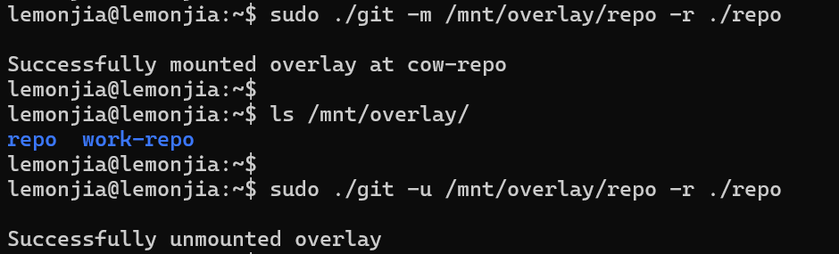
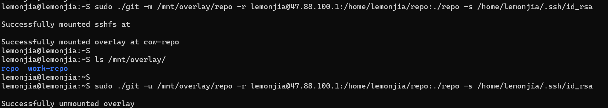

# repo

[](https://github.com/repo-scm/repo/actions?query=workflow%3Aci)
[](https://goreportcard.com/report/github.com/repo-scm/repo)
[](https://github.com/repo-scm/repo/blob/main/LICENSE)
[](https://github.com/repo-scm/repo/tags)


## Introduction

repo workspace with copy-on-write


## Prerequisites

- Go >= 1.24.0


## Usage

```
Usage:
  repo [flags]

Flags:
  -h, --help              help for repo
  -n, --manifest string   manifest file (user@host:/remote/manifest.xml:/local/manifest.xml)
  -m, --mount string      mount path
  -s, --sshkey string     sshkey file (/path/to/id_rsa)
  -u, --unmount string    unmount path
  -v, --version           version for repo
```


## Example

### 1. Overlay

#### Preparation

```bash
cd /path/to/aosp

export REPO_URL='https://mirrors.tuna.tsinghua.edu.cn/git/git-repo'
export AOSP_MANIFEST='https://github.com/repo-scm/manifest'

repo init --partial-clone -b main -u $AOSP_MANIFEST --manifest-depth=1 -c --depth=1 -b main
repo sync -c -j4 --fail-fast
repo manifest -o manifest.xml
```

#### Mount

```bash
sudo ./repo --mount /mnt/overlay/aosp --manifest /path/to/aosp/manifest.xml

sudo chown -R $USER:$USER /mnt/overlay/aosp
sudo chown -R $USER:$USER /path/to/cow-aosp
```

#### Test

```bash
cd /mnt/overlay/aosp/system/core

echo "new file" | tee newfile.txt
echo "modified" | tee README.md

git commit -m "repo changes"
git push origin main
```

#### Unmount

```bash
sudo ./repo --unmount /mnt/overlay/aosp --manifest /path/to/aosp/manifest.xml
```

#### Screenshot



### 2. SSHFS and Overlay

#### Preparation

```bash
ssh user@host:/remote/aosp

export REPO_URL='https://mirrors.tuna.tsinghua.edu.cn/git/git-repo'
export AOSP_MANIFEST='https://github.com/repo-scm/manifest'

repo init --partial-clone -b main -u $AOSP_MANIFEST --manifest-depth=1 -c --depth=1 -b main
repo sync -c -j4 --fail-fast
repo manifest -o manifest.xml

exit
```

#### Config

```bash
cat $HOME/.ssh/config
```

```
Host *
    HostName <host>
    User <user>
    Port 22
    IdentityFile ~/.ssh/id_rsa
```

#### Mount

```bash
sudo ./repo --mount /mnt/overlay/aosp --manifest user@host:/remote/aosp/manifest.xml:/local/manifest.xml --sshkey /path/to/id_rsa

sudo chown -R $USER:$USER /mnt/overlay/aosp
sudo chown -R $USER:$USER /path/to/cow-aosp
```

#### Test

```bash
cd /mnt/overlay/aosp/system/core

echo "new file" | tee newfile.txt
echo "modified" | tee README.md

git commit -m "repo changes"
git push origin main
```

#### Unmount

```bash
sudo ./repo --unmount /mnt/overlay/aosp --manifest /local/manifest.xml
```

#### Screenshot




## License

Project License can be found [here](LICENSE).


## Reference

- [google-aosp](https://gist.github.com/craftslab/72bf50a05d047edff95dc2e13992c8b8)
